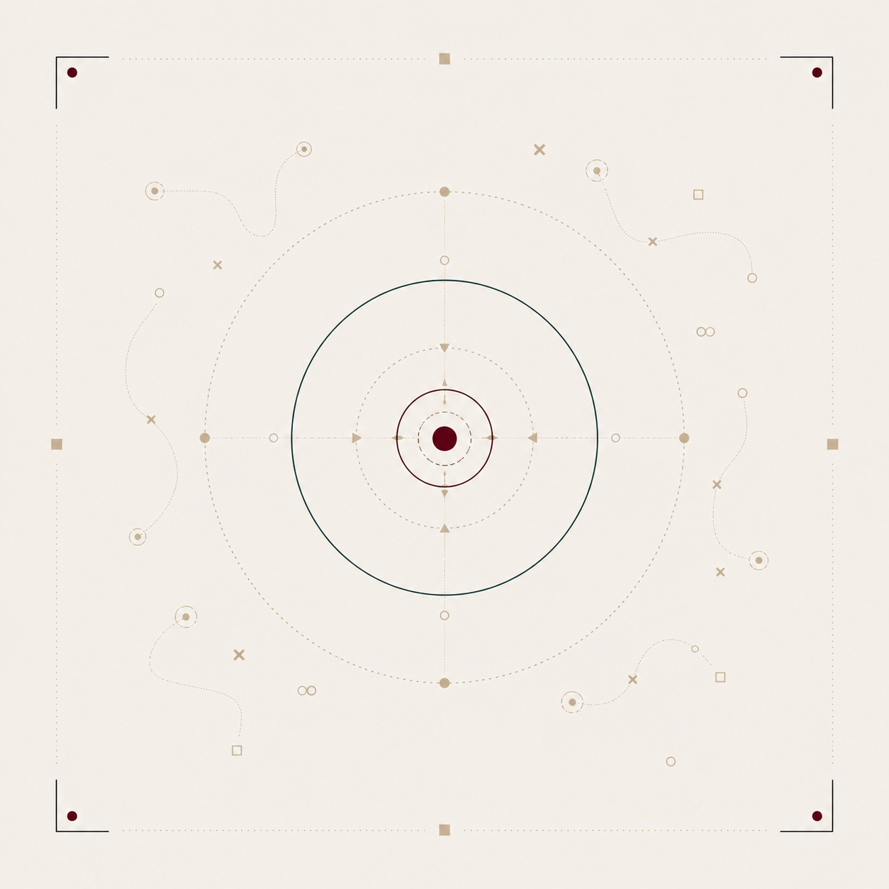
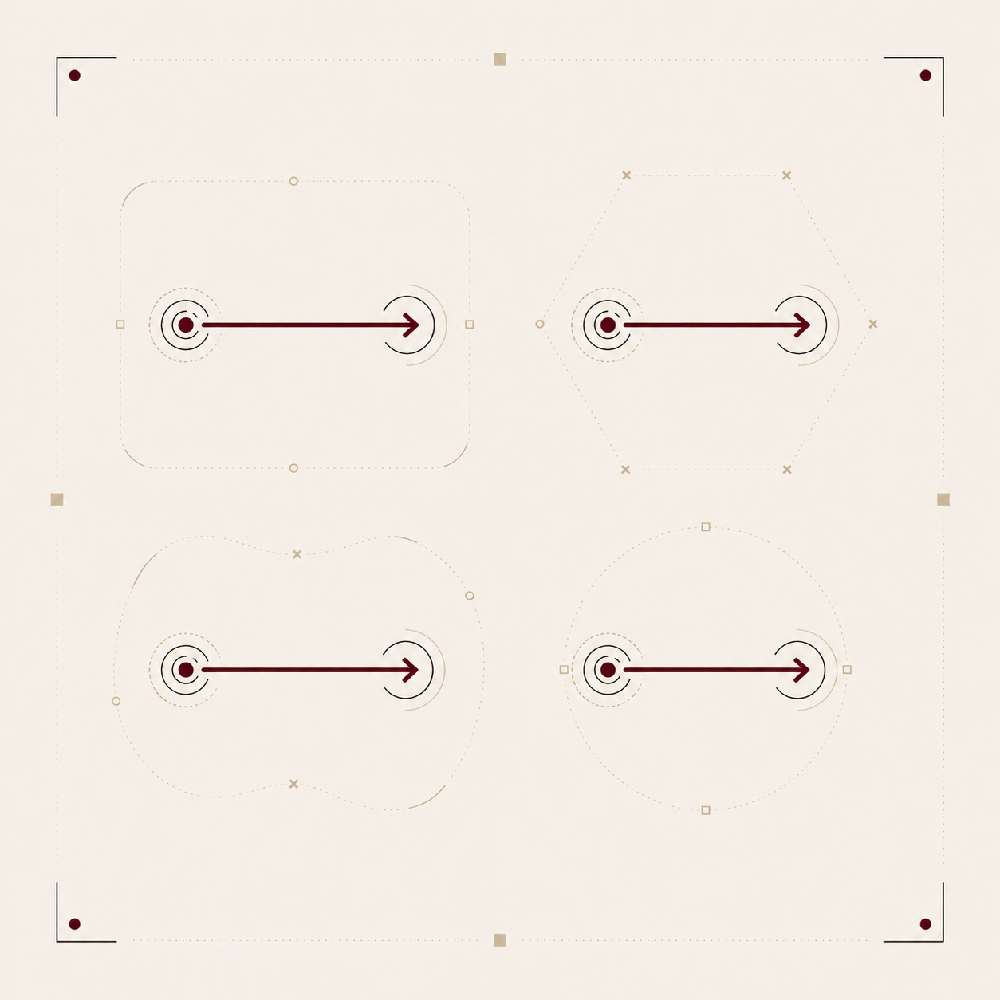
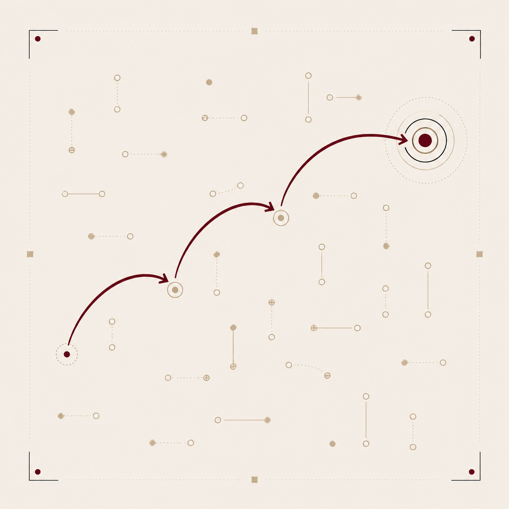
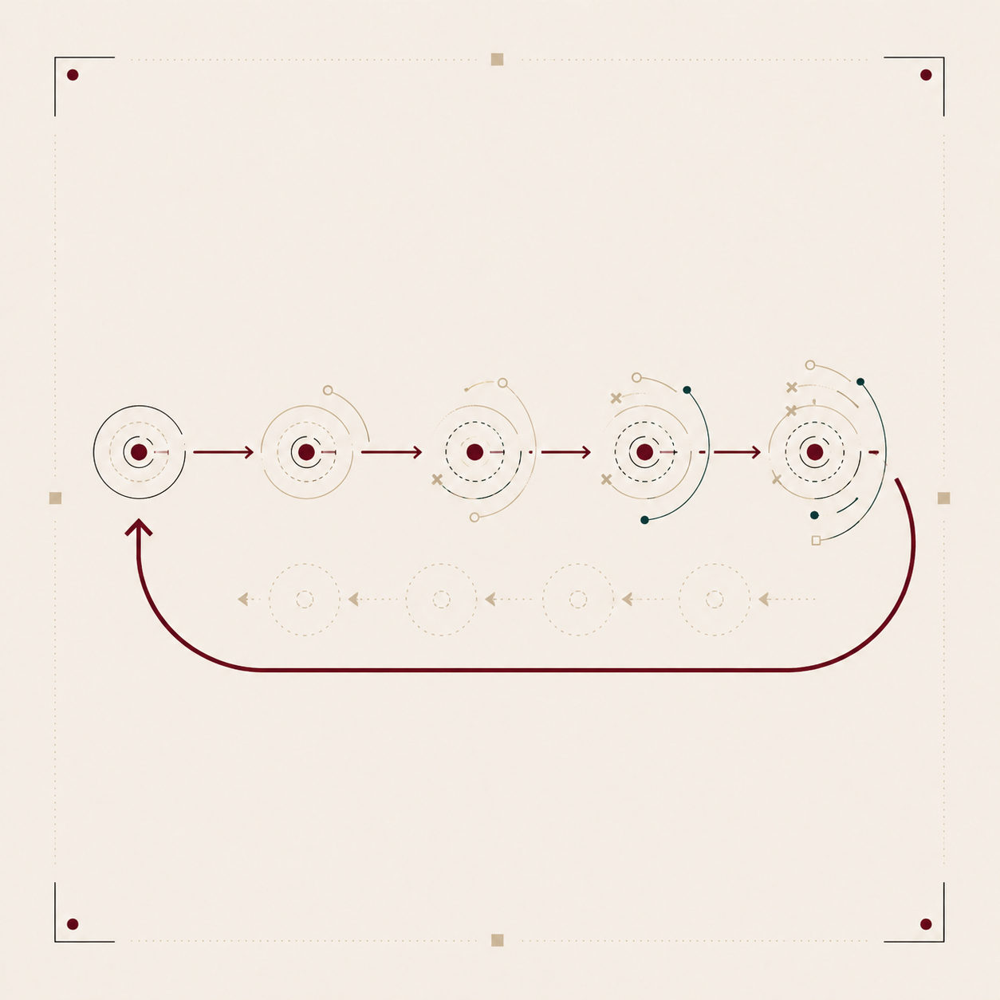
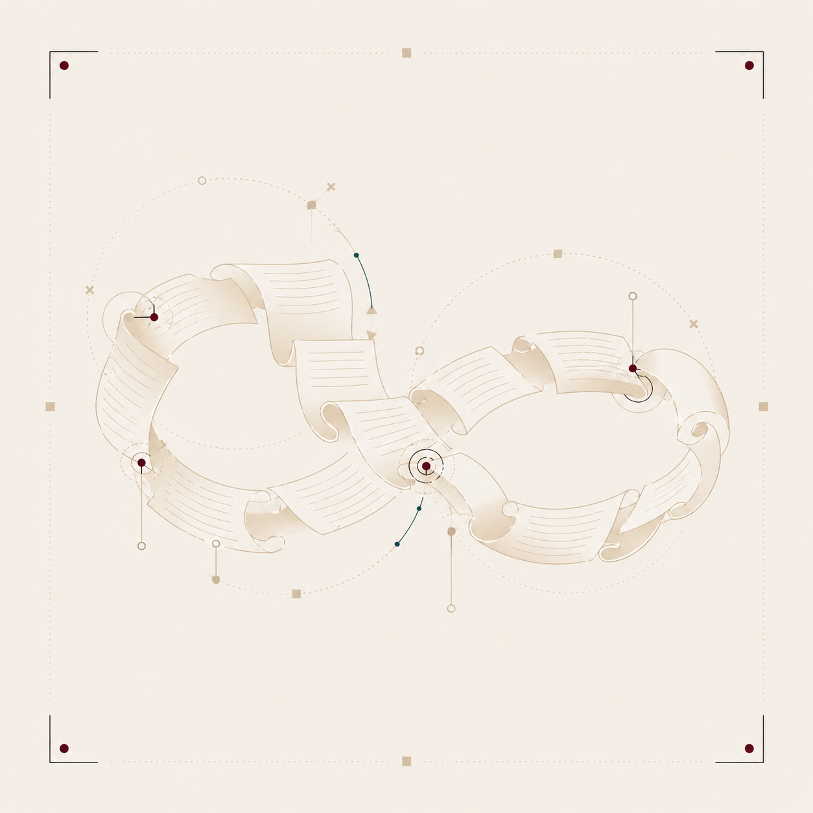
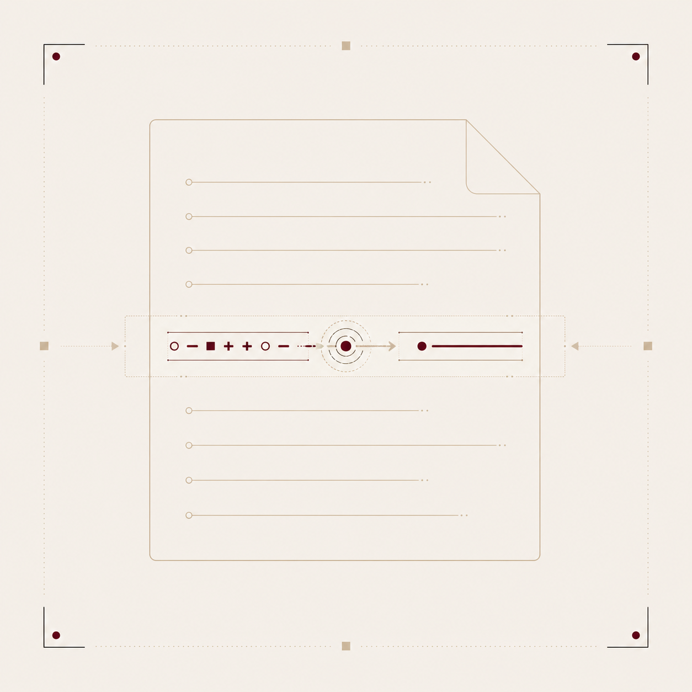

# ofício


`0.0.6 · experimental`

um ofício pede poucos instrumentos bem escolhidos e um único banco onde tudo está ao alcance da mão. este repositório contém um plugin Hermes que dá a agentes mãos explícitas para ler, escanear, marcar e escrever notas num cofre do Obsidian. não é catedral nem sistema operacional — é a oficina onde se trabalha bem.

## raiz

Jef Raskin passou a vida desenhando interfaces que respeitassem o tempo cognitivo de quem as usa (Swyft, Canon Cat, Archy). a tese cabe numa linha: **a interface deve minimizar o intervalo entre intenção e execução sem cobrar tributo de atenção.**

o ofício aplica essa tese a um cotidiano comum: quem escreve, lê e conversa com agentes ao longo do dia. o ponto de partida é um cofre do Obsidian, sincronizado, disponível no desktop e no celular, onde o texto vive antes, durante e depois da ação.

## arquitetura


três camadas, todas leves:

1. **cofre Obsidian** — fonte de verdade, espaço de escrita e leitura.
2. **plugin Hermes** — ferramentas que deixam o agente ler pedidos, escrever respostas e registrar ações no cofre.
3. **convenções de texto** — formato dos pedidos, logs e metadados.

não há painel separado, banco oculto nem caixa de entrada paralela. o que a usuária escreve no Obsidian é o que o agente vê. o que o agente produz volta ao Obsidian como nota, alteração ou log.

## princípios e decisões

cada princípio raskiniano vira decisão concreta de projeto. a ordem é a do impacto no corpo, não a da hierarquia.

### locus de atenção


_a interface respeita o foco e nunca o arranca sem motivo._

> Obsidian é o ponto de partida. agentes não disputam foco: leem o cofre quando há pedido, escrevem de volta quando a resposta pertence ao trabalho. **nada pisca, nada interrompe. olha-se quando se quer.**

### sem modos



_a mesma tecla faz sempre a mesma coisa._

> o cofre fica o mais próximo possível de texto direto. pedidos são notas ou trechos de notas, não estados escondidos. a tabela de atalhos vive em `Hotkeys.md`.

### quasimodos



_estados que existem só enquanto a tecla está pressionada são aceitáveis._

> a invocação de agentes pode ser um gesto curto, mas o resultado vira texto no cofre. o estado termina com o gesto.

### monotonia


_uma única maneira de fazer cada coisa._

> um cofre, uma fonte de verdade, um lugar para pedir trabalho: `agent/oficio/inbox.md`. agentes podem ser muitos; o protocolo é o mesmo.

### LEAP



_busca incremental como navegação primária._

> a navegação é a busca nativa do Obsidian. bons nomes e links explícitos valem mais que indexadores pesados.

### desfazer universal



_toda ação é reversível. sem diálogos de confirmação._

> o desfazer é o do Obsidian. ações de agentes são registradas como texto no cofre — logs diários, metadados de conclusão e marcas de falha tornam tudo auditável.

### texto eterno



_salvar e carregar são vestígios de disquete._

> autossave ligado, sync assumido. agentes escrevem no cofre; não mantêm verdade própria esperando exportação.

### sem aplicativos, só documentos


_o sistema é um espaço contínuo de texto._

> o cofre é o sistema. um pedido a agente é documento. uma resposta de agente também é. a gravidade volta para o texto.

### CALC



_aplicação direta do princípio anterior: uma seleção contendo expressão vira resultado no mesmo lugar com uma única tecla, sem janela auxiliar._

> transformações pequenas acontecem no próprio texto. quando um agente resume, calcula, reescreve ou classifica, o resultado volta ao trecho de origem. sem painel auxiliar, sem conversa paralela quando o documento basta. **(ainda não implementado — ver "o que ainda não existe")**

### habituação e visibilidade


_bons gestos viram automáticos. o efeito de cada ação deve ser visível antes e narrável depois._

> documentação de atalhos e convenções vive como nota do cofre. logs diários registram o que cada agente fez. auditar uma decisão é abrir uma nota.

## o que existe hoje

o plugin Hermes `oficio` (~400 linhas) expõe nove ferramentas e um gancho de sessão.

### ferramentas

| ferramenta | o que faz |
|---|---|
| `oficio_scan` | encontra pedidos `- [ ] @hermes ...` no inbox e na daily note do dia |
| `oficio_read` | lê qualquer nota do cofre |
| `oficio_append` | acrescenta texto a uma nota |
| `oficio_start` | registra início de trabalho no log diário com status pending |
| `oficio_complete` | marca pedido como `[x]` e atualiza entrada no log diário |
| `oficio_fail` | marca falha com erro e atualiza entrada no log diário |
| `oficio_replace` | troca uma string exata por outra (seguro, sem regex) |
| `oficio_today` | mostra os caminhos de inbox e log do dia |
| `oficio_config_show` | mostra a configuração ativa |

### gancho de sessão

`on_session_start`: ao iniciar uma sessão, o plugin escaneia o inbox e a daily note do dia e informa o agente sobre pedidos pendentes — sem executar, sem marcar, sem escrever no cofre. o agente decide se oferece execução. configurável: `scan_daily: false` para escanear só o inbox.

### onde escrever pedidos

dois lugares são escaneados por padrão:

1. **`agent/oficio/inbox.md`** — o lugar canônico, sempre escaneado.
2. **`Daily/YYYY-MM-DD.md`** — sua daily note do Obsidian. escreva `- [ ] @hermes id:...` em qualquer daily e o plugin encontra.

assim você pode chamar o agente do inbox (para pedidos persistentes) ou diretamente da daily (para pedidos do dia). o caminho da daily é configurável: `daily_path: Daily`.

### formato dos pedidos

```markdown
- [ ] @hermes descreva o que o agente deve fazer.
```

o `id:` é opcional. se omitido, o scan gera um ID automático no formato `YYYYMMDD-N` (data + contador do dia). se quiser um ID explícito:

```markdown
- [ ] @hermes id:meu-pedido
  descreva o que o agente deve fazer.
```

a descrição pode seguir na mesma linha (para tarefas curtas) ou nas linhas seguintes indentadas.

### formato dos logs

logs diários vivem em `agent/oficio/log/daily/YYYY-MM-DD.md`. cada entrada é uma seção:

```markdown
## meu-pedido

- status: completed
- at: 2026-04-25T20:00:00-03:00
- source: agent/oficio/inbox.md

resultado ou erro registrado aqui.
```

quando o agente inicia uma tarefa, `oficio_start` escreve uma entrada com `status: pending`. ao completar ou falhar, o status é atualizado na mesma seção (de `pending` para `completed` ou `failed`).

### propriedades (novo em 0.0.3)

inbox e logs têm frontmatter YAML (compatível com Obsidian Properties):

```yaml
---
tags: [oficio/inbox]
type: inbox
---
```

```yaml
---
tags: [oficio/log]
type: log
date: 2026-04-25
---
```

### comandos slash

```
/oficio scan [path]
/oficio config
/oficio today
/oficio start <id> <resumo...>
/oficio complete <id> <nota...>
/oficio fail <id> <erro...>
```

### template rápido

para inserir um bloco `@hermes` com um atalho no Obsidian, use o template `hermes-request` (já incluso no diretório `Templates/` do cofre). com o plugin Templates do Obsidian habilitado:

1. posicione o cursor onde quer o pedido.
2. `Cmd/Ctrl+T` → escolha `hermes-request`.
3. preencha o id e a descrição.

o template usa placeholders `${1}`, `${2}`, `${0}` para navegação rápida entre campos.

## o que ainda não existe

a lista abaixo registra o que os princípios pedem mas a implementação atual ainda não cobre. cada item é uma decisão pendente, não uma promessa.

- **CALC / transformações inline**: selecionar texto no cofre, aplicar transformação (resumo, cálculo, reescrita) e ver o resultado no mesmo lugar. conceito documentado, implementação futura.
- **plugins auxiliares no Obsidian**: a filosofia prefere poucos plugins, mas dataview ou quick-add podem reduzir atrito sem violar princípios. o template `hermes-request` já está disponível. a decisão sobre plugins adicionais ainda está aberta.
- **agentes múltiplos simultâneos**: o protocolo suporta múltiplos agentes (cada um com seu marcador), mas o plugin atual só escaneia `@hermes`. generalização futura.
- **inbox diário opcional**: a configuração prevê `use_daily_inbox`, mas o fluxo canônico usa um inbox único. a rota diária existe como possibilidade, não como padrão testado.

## sincronização do cofre (novo em 0.0.5)

o script `scripts/oficio-sync.py` implementa um scanner com debounce para detectar pedidos pendentes no inbox e na daily note:

```bash
# executar uma vez, ignorando debounce (útil para teste)
python scripts/oficio-sync.py --once

# executar uma vez, respeitando debounce de 15s
python scripts/oficio-sync.py

# loop contínuo (para terminal)
python scripts/oficio-sync.py --watch
```

**debounce configurável**: por padrão, arquivos modificados há menos de 15 segundos são ignorados — a usuária ainda pode estar escrevendo. ajuste com a variável de ambiente `OFICIO_DEBOUNCE` (em segundos).

**estado rastreado**: o script mantém um arquivo `.oficio-sync-state.json` no diretório `agent/` do cofre, lembrando quais ids já foram reportados. cada execução só emite pedidos *novos*.

**integração com cron do Hermes**: o lugar natural para rodar o sync é um cron visível:

```
hermes cron create "oficio-sync" --every 1m \
  --script scripts/oficio-sync.py
```

assim o agente é notificado automaticamente quando um novo pedido aparece, sem daemon oculto e com debounce respeitando o tempo de escrita.

## uso

```bash
# clonar e linkar
git clone https://github.com/agentescognitivos/oficio ~/git/oficio
ln -s ~/git/oficio ~/.hermes/plugins/oficio
hermes plugins enable oficio

# testar
cd ~/git/oficio
nix shell nixpkgs#python312 nixpkgs#python312Packages.pytest -c sh -lc 'PYTHONPATH=. pytest -q'
```

fluxo real:

1. escreva um pedido em qualquer um destes lugares:
   - **`agent/oficio/inbox.md`** — pedidos persistentes:
     ```markdown
     - [ ] @hermes resuma a daily note de hoje.
     ```
   - **sua daily note** (`Daily/YYYY-MM-DD.md`) — pedidos do dia, usando o template `hermes-request`.
2. no Hermes, use `/oficio scan` ou peça ao agente para escanear (ele escaneia os dois lugares).
3. ao iniciar o trabalho, o agente chama `oficio_start` para registrar status pending no log.
4. depois de executar, o agente chama `oficio_complete` (ou `oficio_fail` se der erro).
5. confira no Obsidian: a tarefa virou `[x]` e o log diário tem a entrada com status atualizado.

## estado

versão 0.0.6. em uso pessoal, ainda exploratório. as convenções estabilizam em torno de uma tese: **Obsidian é a mesa, o cofre é a memória, agentes são mãos auxiliares.** contribuições bem-vindas. antes de propor recurso, pergunte se ele respeita um dos princípios acima. se existe só para conforto de catálogo, provavelmente não vai entrar.

## licença

MIT.
