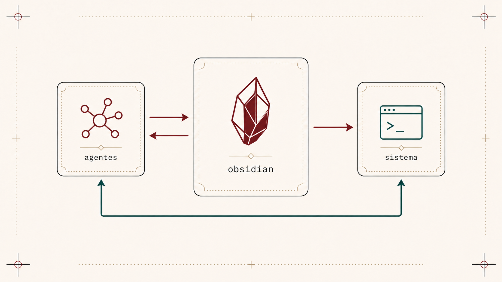
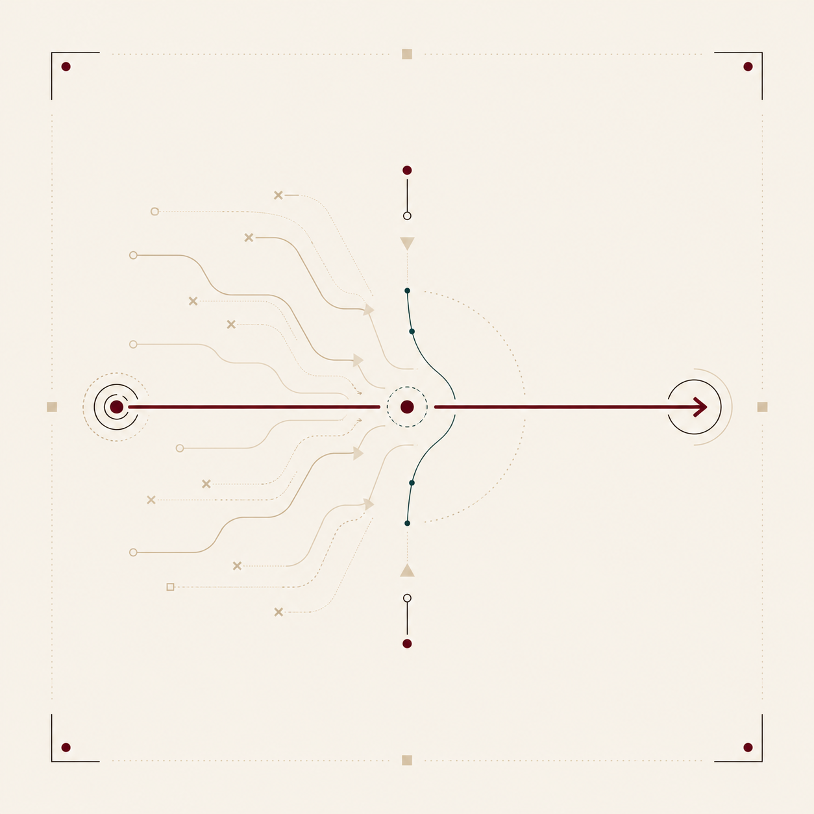
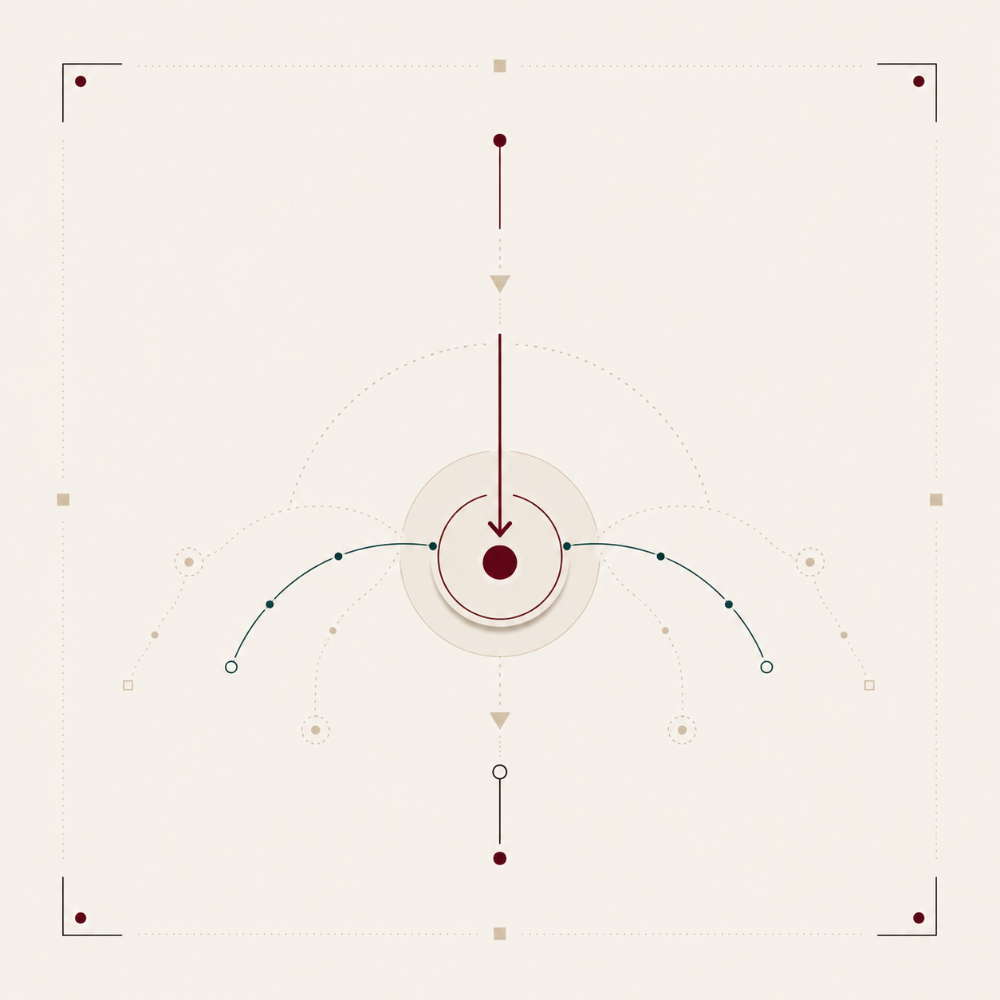
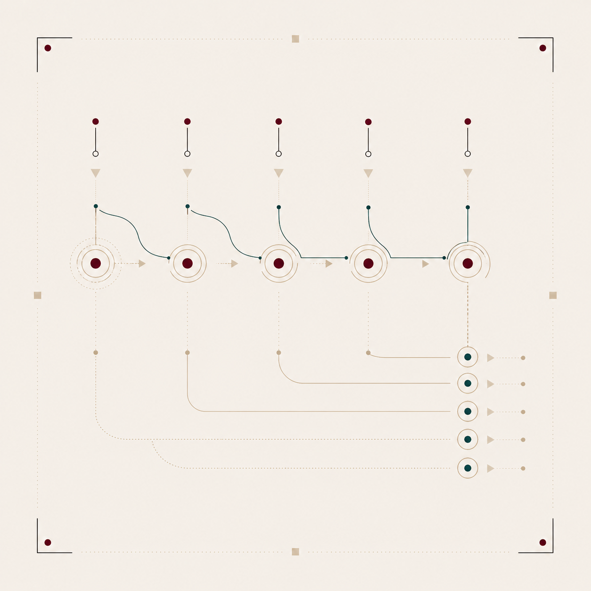
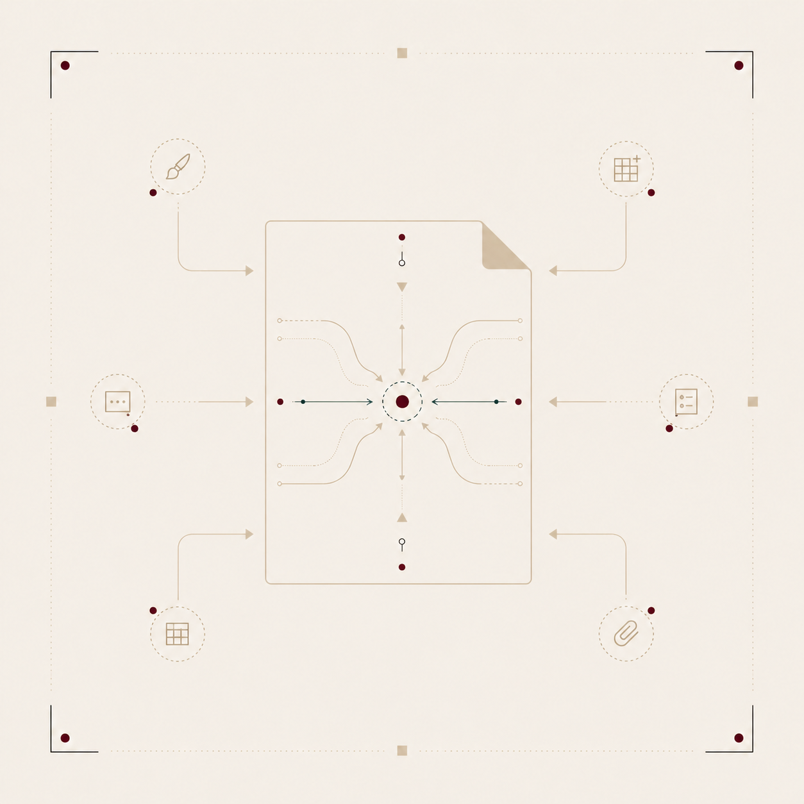

# ofício


`0.0.7 · experimental`

um ofício pede poucos instrumentos bem escolhidos e um único banco onde tudo está ao alcance da mão. este repositório contém um plugin Hermes que dá a agentes mãos explícitas para ler, escanear, marcar e escrever notas num cofre do Obsidian. não é catedral nem sistema operacional — é a oficina onde se trabalha bem.

## raiz

Jef Raskin passou a vida desenhando interfaces que respeitassem o tempo cognitivo de quem as usa (Swyft, Canon Cat, Archy). a tese cabe numa linha: **a interface deve minimizar o intervalo entre intenção e execução sem cobrar tributo de atenção.**

o ofício aplica essa tese a um cotidiano comum: quem escreve, lê e conversa com agentes ao longo do dia. o ponto de partida é um cofre do Obsidian, sincronizado, disponível no desktop e no celular, onde o texto vive antes, durante e depois da ação.

## arquitetura



três camadas, todas leves:

1. **cofre Obsidian** — fonte de verdade, espaço de escrita e leitura.
2. **plugin Hermes** — ferramentas que deixam o agente ler pedidos, escrever respostas e registrar ações no cofre.
3. **convenções de texto** — formato dos pedidos, logs e metadados.

não há painel separado, banco oculto nem caixa de entrada paralela. o que a usuária escreve no Obsidian é o que o agente vê. o que o agente produz volta ao Obsidian como nota, alteração ou log.

## princípios e decisões

cada princípio vira decisão concreta de projeto. a ordem é a do impacto no corpo, não a da hierarquia.

### locus de atenção



_a interface respeita o foco e nunca o arranca sem motivo._

> Obsidian é o ponto de partida. agentes não disputam foco: leem o cofre quando há pedido, escrevem de volta quando a resposta pertence ao trabalho. **nada pisca, nada interrompe. olha-se quando se quer.**

### monotonia



_uma única maneira de fazer cada coisa._

> um cofre, uma fonte de verdade, um lugar para pedir trabalho: `agent/oficio/inbox.md`. agentes podem ser muitos; o protocolo é o mesmo.

### habituação e visibilidade



_bons gestos viram automáticos. o efeito de cada ação deve ser visível antes e narrável depois._

> documentação de atalhos e convenções vive como nota do cofre. logs diários registram o que cada agente fez. auditar uma decisão é abrir uma nota.

### sem aplicativos, só documentos



_o sistema é um espaço contínuo de texto._

> o cofre é o sistema. um pedido a agente é documento. uma resposta de agente também é. a gravidade volta para o texto.

## o que existe hoje

o plugin Hermes `oficio` expõe onze ferramentas e um gancho de sessão.

### ferramentas

| ferramenta | o que faz |
|---|---|
| `oficio_scan` | encontra pedidos `- [ ] @hermes ...` no inbox e na daily note do dia |
| `oficio_read` | lê qualquer nota do cofre |
| `oficio_append` | acrescenta texto a uma nota |
| `oficio_start` | registra início de trabalho no log diário |
| `oficio_complete` | marca pedido como `[x]` e atualiza o log |
| `oficio_fail` | marca falha com erro e atualiza o log |
| `oficio_replace` | troca uma string exata por outra (seguro, sem regex) |
| `oficio_today` | mostra os caminhos de inbox e log do dia |
| `oficio_config_show` | mostra a configuração ativa |
| `oficio_summary` | agrega logs diários recentes em resumo plain-text ou markdown |
| `oficio_request` | cria um novo pedido pendente no inbox; sem `id`, gera slug a partir do título/descrição e evita colisão com inbox/log |

### gancho de sessão

`on_session_start`: ao iniciar uma sessão, o plugin escaneia o inbox e a daily note do dia e informa o agente sobre pedidos pendentes — sem executar, sem marcar, sem escrever no cofre.

### onde escrever pedidos

dois lugares são escaneados por padrão:

1. **`agent/oficio/inbox.md`** — o lugar canônico, sempre escaneado.
2. **`Daily/YYYY-MM-DD.md`** — sua daily note do Obsidian. escreva `- [ ] @hermes` em qualquer daily e o plugin encontra.

### formato dos pedidos

```markdown
- [ ] @hermes descreva o que o agente deve fazer.
```

o `id:` é opcional. se omitido em pedidos escritos à mão no Obsidian, o scan continua gerando um ID automático no formato `YYYYMMDD-N` para referência temporária. já na ferramenta `oficio_request`, quando o `id` é omitido o plugin gera um slug legível a partir da descrição/título (por exemplo `algo-relacionado-ao-titulo`) e valida colisões no inbox e no log diário antes de escrever; se o slug já existir, escolhe uma variação livre como `algo-relacionado-ao-titulo-2`. assim, o próprio título já produz um identificador humano e o log continua servindo como lugar visível de verificação de unicidade.

```markdown
- [ ] @hermes id:meu-pedido
  descreva o que o agente deve fazer.
```

### formato dos logs

logs diários vivem em `agent/oficio/log/daily/YYYY-MM-DD.md`:

```markdown
## meu-pedido

- status: completed
- at: 2026-04-25T20:00:00-03:00
- source: agent/oficio/inbox.md

resultado ou erro registrado aqui.
```

### comandos slash

```
/oficio scan [path]
/oficio config
/oficio today
/oficio start <id> <resumo...>
/oficio complete <id> <nota...>
/oficio fail <id> <erro...>
```

### template rápido

para inserir um bloco `@hermes` com um atalho no Obsidian, use o template `hermes-request` (em `Templates/`). com o plugin Templates habilitado:

1. posicione o cursor onde quer o pedido.
2. `Cmd/Ctrl+T` → escolha `hermes-request`.
3. preencha o id e a descrição.

## sincronização

o script `scripts/oficio-sync.py` escaneia o cofre com debounce configurável (padrão 15s), emitindo apenas pedidos novos. integração natural com cron do Hermes:

```
hermes cron create "oficio-sync" --every 1m --script scripts/oficio-sync.py
```

## uso

```bash
# clonar e linkar
git clone https://codeberg.org/agentescognitivos/oficio ~/git/oficio
ln -s ~/git/oficio ~/.hermes/plugins/oficio
hermes plugins enable oficio

# testar
cd ~/git/oficio
nix shell nixpkgs#python312 nixpkgs#python312Packages.pytest -c sh -lc 'PYTHONPATH=. pytest -q'
```

fluxo real:

1. escreva um pedido no inbox (`agent/oficio/inbox.md`) ou na daily note.
2. no Hermes, use `/oficio scan` ou peça ao agente para escanear.
3. ao iniciar o trabalho, o agente chama `oficio_start`.
4. depois de executar, o agente chama `oficio_complete` (ou `oficio_fail`).
5. confira no Obsidian: a tarefa virou `[x]` e o log diário tem a entrada.

## estado

versão 0.0.7. em uso pessoal, ainda exploratório. as convenções estabilizam em torno de uma tese: **Obsidian é a mesa, o cofre é a memória, agentes são mãos auxiliares.** contribuições bem-vindas. antes de propor recurso, pergunte se ele respeita um dos princípios acima. se existe só para conforto de catálogo, provavelmente não vai entrar.

## licença

MIT.
